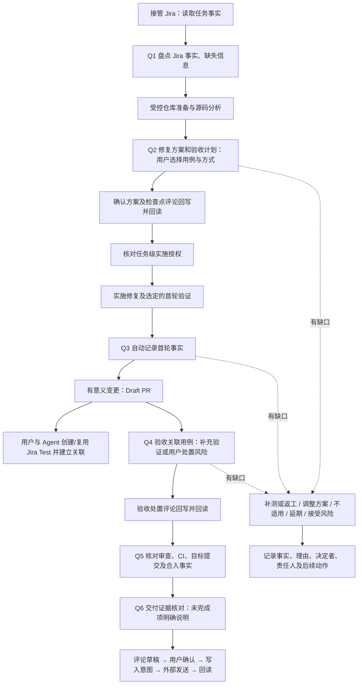

# 质量检查与证据

质量检查采用“必须核对、用户决定处置”的方式。Agent 提议验收用例及验证方式，用户选择；测试工具提供执行结果，用户决定是否验收、补测、不适用、延期或接受风险。接受风险不会把失败或未执行改为通过。

本文说明稳定操作方式。项目标准来自 `projects/<project>/quality.json` 和 `admission.json`，输入及恢复契约来自 `contracts/quality-action.schema.json`、`quality-state.schema.json`。工作项与最终证据仍在 Jira；本地记录只是任务 run 的执行及恢复材料。[任务授权](task-authorization.md)和[安全边界](../security/permissions.md)独立生效。

## 流程与检查点



| 检查点 | 核对内容 | 当前阶段强制点 |
|---|---|---|
| Q1 接管与盘点 | Jira 任务事实和缺失信息；接管不要求预先存在 Test | Q1、Q2 的用户处置在进入 `implementation` 前检查；缺普通信息可先分析，仓库基线与权限仍须可靠 |
| Q2 方案与验收 | 根因、修复范围、验收场景、每项预期和方式、修复前复现，以及合格 Q3 事实回写/推送/Draft PR 的授权 | 一次确认进入 `implementation`；Test 的定义和编写由用户与 Agent 处理 |
| Q3 首轮验证与 Draft PR | Q2 已选的全部修复后检查项在最终完整 SHA 上的首轮结果、可审阅变更和风险 | 自动事实检查点，不再重复要求用户接受首轮验证；任一结果不符合预期、证据不完整或外部回读不明即停止 |
| Q4 关联用例验收 | 编码后 Jira「已链接工作项」中的 Test、Test Type、用例版本、当前代码、执行证据和用户逐项确认 | 进入 `ci_validation` 前；只有全部受管用例 PASS 才可尝试 Tests Passed |
| Q5 审查及 CI | PR 仓库与 Head、检查结果、目标用例是否运行、审查或合入的回读事实 | Q5、Q6 在本地 `completed` 前 |
| Q6 交付证据 | 已完成和待完成事项、风险责任、Jira/发布事实及后续接力 | 本地完成仅代表本轮执行结束，不能据此声称 Jira Done 或已发布 |

首个有意义提交并完成第一轮针对性验证后建议创建 Draft PR。若验证受阻，披露现状并按 TapData 标准中首个有意义提交／一个工作日要求处理；不等待全量验证全绿。正式提审与 Jira `PR Submitted` 仍遵循 `Tests Passed` 等外部条件。

以上是现有 `task.py advance` 的强制检查点。Q2 是方案、验收方式和后续自动动作的一次性确认；Q3 只在全部已确认的修复后检查项已有当前完整 SHA 的预期结果时使用 `auto_checkpoint` 记录事实并回写 Jira。它不等同于用户验收，也不能在失败、跳过、未知、计划变化或外部回读不明时推进。Hook 继续执行既有操作授权和安全策略；本版不宣称拦截任意工具绕开 Workflow 的每一次质量相关操作。不要跳过 Workflow，也不要因本地处置而绕过服务端 Validator 或保护分支。

## 非阻断 Jira 状态同步

接管从 `waiting_takeover` 进入 `task_intake` 前，Agent 先读取当前 Jira issue，并以 `jira_watermark.py prepare` 从工作空间绑定的 Product Root 生成当前 `agenticops_version`。当 Jira 的项目配置字段已经等于该版本时直接回读验证；否则，Gate 只为当前 task/run 的同一字段和载荷摘要放行一次明确 Jira 编辑工具的覆盖写入，随后必须以 `complete` 导入回读。字段写入、权限或回读不明确时不得重发；保留同一 run，并可使用新的只读 Jira 快照再次 `complete`。Product Root 版本或工作项类型变化时不得确认旧水印成功，也不得推进接管。

缺陷进入 `task_intake` 后，Agent 立即读取当前 Jira issue、当前用户和可用 transitions，以 `takeover` 节点执行一次 `jira_status.py prepare`。当前状态已是 `In Progress` 时直接记录；当前状态为 `Analyzed`、Assignee 为当前用户且 Jira 返回配置的 transition 时，工具生成精确 transition 意图，Agent 当场调用原生 Jira 工具一次并用 `complete` 导入回读。状态不匹配、必填字段缺失、权限或外部调用失败只记录和提示，不回退本地阶段、不重试。

Q4 有效确认并进入 `ci_validation` 后，以 `tests_passed` 节点执行相同步骤。接管阶段不要求创建 Test；编码完成后由用户与 Agent 根据已确认的验收方案创建或复用 Test，并通过「已链接工作项」关联缺陷。只有当前状态为 `In Progress`、Q4 总体处置为 `accept`、全部受管 Test 均有当前完整提交 SHA 的 PASS 证据且用户逐项 `accept`、并且 Jira 返回目标 transition 时才生成意图。`Pull Request Submitted` 不自动执行。

输入由 Agent 从 Jira 实时读取，至少包含任务、字段、当前用户、可用 transitions 和可回查来源：

```json
{
  "source_ref": "可回查的 Jira 读取来源",
  "current_user": {"accountId": "当前 Jira 用户 accountId"},
  "issue": {"key": "TAP-123", "fields": {"status": {"id": "状态 ID", "name": "Analyzed"}, "assignee": {"accountId": "当前 Jira 用户 accountId"}, "issuelinks": []}},
  "linked_test_details": [
    {"key": "TAP-TEST-1", "test_type": "Manual", "case_version": "Jira updated 或 Xray 版本引用", "source_ref": "该 Test Details 的可回查 Jira 来源"}
  ],
  "transitions": [{"id": "421", "name": "Start Investigation", "to": {"id": "目标状态 ID", "name": "In Progress"}, "fields": {}}]
}
```

`linked_test_details` 只在 Tests Passed 或 PR Ready 核对时必需：它是 Agent 从 Jira/Xray Test Details 读取的事实，不由 AgenticOps 推断或写入。无法读取时，工具会要求用户提供关联 Test key、Test Type、用例版本引用和 Jira 来源。`Manual`、`TapTest`、`Unit` 是当前受管类型；`TapCE` 显式忽略但不算通过。若只有 TapCE、类型不支持、关联缺失或 Jira Validator 仍要求 TapCE，用户调整 Jira 或验收方案后重新读取并重做预检；不得盲目重放已经发起的 Jira 状态转换。

```sh
python3 "$agenticops_root/workflow/jira_status.py" prepare \
  --issue-key "$task_key" --trigger takeover --input "$jira_snapshot" --dir "$project_workspace"

python3 "$agenticops_root/workflow/jira_status.py" complete \
  --issue-key "$task_key" --trigger takeover --outcome failed \
  --input "$jira_readback" --message "Jira 原始错误摘要" --dir "$project_workspace"
```

`prepare.outcome=ready` 时只使用返回的 `transition_id` 调用一次原生 Jira transition；Hook 只对当前 task/run 的这条精确意图放行。调用超时或结果不明时先回读；已到目标状态由 `complete` 记为成功，否则按 `unknown` 记录，不盲目重放。同一 run 的同一节点再次 prepare 只返回原记录。

转换 metadata 标记的必填字段为空时，`prepare` 不尝试写入，按 Project `field_mappings` 输出字段名、采集时机、本地来源是否已具备、可否自动填写和处理方式。根因、Module、Tester、测试设计结论、Xray 和测试例外等专业事实不能由 Agent 猜测；可从本地已确认方案和证据形成填写依据，但必须由责任人确认后在 Jira/Xray 补齐并回读。当前节点不重新尝试，最终在 PR Ready 输出人工待办。

| Jira 目标状态 | Jira 属性或关系 | 本地任务映射 | 处理时机与边界 |
|---|---|---|---|
| `In Progress` | Assignee / Engineering DRI | 无可替代的本地事实 | 接管前核对当前 Jira 用户与 Assignee；不一致不改派，跳过转换 |
| `Tests Passed` | Issue Classification、Root Cause Category | `facts.fix_plan` 仅提供已确认根因依据 | Q2 形成；Jira 枚举值由责任人选择，不从文本猜测 |
| `Tests Passed` | Module | 任务 `repositories` 与问题归属证据 | 目标仓库确认时形成；映射不唯一时人工选择最终一级 Module |
| `Tests Passed` | Issue Analysis | `facts.fix_plan`、Q2 已回读评论 | Q2 后补失效机制、触发条件、影响与证据，不生成未确认结论 |
| `Tests Passed` | Fix Details | `facts.fix_plan`、实际提交、Q4 验证 | 实现与验收后补处理方式、结果、边界和限制；计划不能冒充完成事实 |
| `Tests Passed` | Tester、Test can be automated | Q2 验收方案及实际责任人 | 由责任人确认；手工用例可选 `No`，但不等于免测 |
| `Tests Passed` | Fix Version | `facts.issue_version_plan` 只提供版本与修复线依据 | Tests Passed 前选择实际交付版本；不得把分支名或影响版本猜成 Jira 选项 ID |
| `Tests Passed` | Xray Test 关联 | Q1-Q4 检查项和 Jira「已链接工作项」中的 Test 任务 | 正常路径至少关联一项正式 Test 任务；每项均需以 PASS 执行证据获得用户 `accept` 确认，本地检查项不能替代 Jira 关联 |
| `Tests Passed` | Test Coverage Decision / Exception Details | 无默认本地自动值 | 仅在合规 T3 低风险例外获批后人工填写；否则不能借例外绕过测试 |

转换面板实时返回的 required fields 是本次尝试的最终事实源；上表用于提前采集和解释，不覆盖 Jira Workflow。若本地来源已具备，Agent 引导责任人据此回填；若来源缺失、值需专业判断、选项 ID 无法可靠解析或写后回读不一致，就跳过本节点转换，保留具体字段和 Jira 原始错误的脱敏摘要，在 PR Ready 一次列全人工事项。

## PR Ready 核对

正式提审前，先为每个任务仓库记录 PR，并使用 `ci.py watch` 取得当前 PR Head 的最新 Checks。Agent 同时从 Jira 读取当前任务 `fields.issuelinks` 与每个关联 Test 的 Test Details：只接受 Project 配置的关系（TapData 缺陷侧为 `tests`）指向、且任务类型为 `Test` 的关联项，输入 `pr_ready.py`：

```json
{
  "source_ref": "可回查的 Jira 读取来源",
  "issue": {
    "key": "TAP-123",
    "fields": {
      "issuelinks": [
        {
          "type": {"outward": "tests"},
          "outwardIssue": {
            "key": "TAP-TEST-1",
            "fields": {"issuetype": {"name": "Test"}}
          }
        }
      ]
    }
  },
  "linked_test_details": [
    {"key": "TAP-TEST-1", "test_type": "Manual", "case_version": "Jira updated 或 Xray 版本引用", "source_ref": "该 Test Details 的可回查 Jira 来源"}
  ]
}
```

```sh
python3 "$agenticops_root/workflow/pr_ready.py" \
  --issue-key "$task_key" --jira-input "$jira_test_tasks" --dir "$project_workspace"
```

工具只在以下三组均通过时返回 ready：从 Jira「已链接工作项」派生的受管 Test 非空，每个 Test 的 Test Type 与用例版本可回读，且每个 Test 都在 Q4 以同一 `case_ref`、当前 Jira 用例版本和对应方式建立检查项，并由用户基于当前 SHA 的 PASS 执行证据逐项作出 `accept` 确认；每个任务仓库都记录 PR，最新 Checks 为 `success` 且 Head 等于当前任务代码；Q1-Q4、其检查项和要求的 Jira 评论回读均有效。Jira Test 工作项本身不要求为 Done。没有符合关系和类型的 Test、未逐项确认、Checks 为空、跳过、未知、等待或失败、Head 漂移、`defer/accept_risk/rework` 都会列为待办。`Test Coverage Decision / Exception Details` 只能记录合规例外，不能替代 Test 关联。Jira 状态同步失败单独列入 `jira_status_todos`，不改变三类验收事实；Engineering DRI 处理待办后重新核对，并手工执行 `Pull Request Submitted`。

## 影响版本与优先修复线

TapData 缺陷的“问题版本”对应 Jira `fields.versions`（影响版本，允许多选），不是描述字段，也不是 `fixVersions`。所有影响版本均保留：先检查 `develop` 是否存在同一缺陷；若存在，本次只在 `develop` 修复，其它影响版本由研发合并修复并分别验证。若 `develop` 不受影响，则选择一个影响版本编码，其余列为人工合并项；只有一个候选时自动选取，多候选需明确选择。主仓任一影响版本分支不存在则拒绝；网络或权限失败只是未核验，不能默认为分支不存在或缺陷不在 develop。

在登记/准备实现基线前，Agent 原生读取 Jira 和源码/复现证据，然后执行 `task.py issue-versions --issue-key <issue> --expected-run-id <run> --input <json> --dir <workspace>`。输入示例中的 SHA 和引用必须替换为真实事实；该工具记录调用者提供的 Jira/分析来源，不认证外部操作者，也不替代 Jira 客户端：

```json
{
  "issue": {"key": "TAP-123", "fields": {"versions": [{"id": "101", "name": "4.18.0"}, {"id": "102", "name": "4.21.0"}]}},
  "source_ref": "可回查的 Jira 任务读取来源",
  "develop": {"status": "present", "revision": "主仓 develop 的完整提交 SHA", "source_ref": "对应源码分析或复现证据"}
}
```

`develop.status` 只接受有证据的 `present/absent`，未知时继续核验，不能猜。`absent` 且有多个候选时增加 `selected_version_id`。输出的 `branch_references` 会逐项保留全部 Jira 影响版本、对应主仓分支、远端 SHA 和来源，并额外列出 `develop` 分析线；用户可将这些条目引用到 Jira 的分支确认中。它们是远端关系引用，不是“当前问题已归属该仓库”的断言，也不会自动成为任务基线；实施前仍由 `repository add` 和 `repository prepare` 固化实际 `base_sha`。规则来自 Project admission，主仓远端查询只读并记录 `refs_verified_at`，它代表当次核验时间，不是未来实时状态。准入/实施推进要求当前 run 的有效版本规划；`record --force` 也不能覆盖结构化版本事实。基线已固化后改修复线需 cleanup/reset 并重新确认授权。

首次判断也可先准备 develop 工作树作只读调查，再导入初次规划；已准备基线与选定修复线、主仓核验 SHA 相符时不要求重开任务。需要切换修复线或修改已有规划时才使用受控清理与重置。

用输出的 `primary_branch` 进行产品分支对齐，模块按其对齐结果准备，不把主仓分支名套给所有模块。TapData 的 `--tapdata-root` 指包含模块仓库的产品目录；`hazelcast` 固定参与并使用 `release-v5.5.0`。版本核验不改变 Source Pool 或当前工作树。

## 检查项、执行及决定

一个检查点可以有多个检查项；一个检查项只能对应一个用例和一种验证方式。需要两种方式时建两个检查项。同一用例可用于修复前、后两个检查项，各自写明预期，保留独立证据。

- `plan`：稳定检查项 ID、检查点、`before_fix/after_fix`、用例引用及版本、`existing/proposed`、单一方式、仓库、目标代码版本、范围、预期及 `expected_result`。
- `executions`：可有多次执行；每次保留唯一编号、用例与代码版本、环境、来源、报告引用、观察时间、观察内容和原始结果。重试用新编号，不覆盖历史。
- `selection`：用户选择了该用例和方式的来源记录。先展示用例、预期、时机、成本与可行性，再记录用户选择；摘要哈希不是用户审批对象。
- `decision`：用户针对当前证据的处置、理由和确认来源。通过需明确选择当前用例及代码最后一条适用执行；计划变更及新证据使相关旧确认失效。
- `auto_checkpoint`：仅供 Project 标记为自动的检查点使用；它不接受伪造的用户确认，要求全部已选修复后项在当前完整提交 SHA 上有预期原始结果。TapData 的 Q3 据此记录首轮事实；Q4 仍需用户对关联 Test 的最终验收。

Q2 前通过 `task.py record --key fix_plan --value "根因、范围、修复方式、风险及回滚"` 保存实际方案，使确认和 Jira 回写包含修复内容而不只是测试清单。手工用例必须提供可操作 `steps`。修复后计划可先填 `target_revision: pending`，执行前用 `item` 更新为精确代码；只更新该字段不使已选用例失效，但会使该项旧执行处置失效。步骤、用例、方式、预期或范围实质变化仍需重新选择。

手工执行导入不接受分支名、短 SHA 或工作区占位符，必须绑定完整提交 SHA。首轮本地 Maven 自动验证允许 `git_revision` 的精确工作区指纹，以支持提交前测试；Q4 起的通过处置必须绑定完整提交。提交后须重新核对/执行，不能仅把旧报告版本字段改成新 SHA。实际测试在旧 SHA 时保留原证据并明确缺口，不能冒充当前提交已验证。

修复前不能执行时可以保留 `NOT_RUN`，解释原因并由用户延期、调整计划或接受风险。修复后项在 Q2 是 `not_due`，不能误报为缺失或失败。修改时机通过 `item` 更新并写理由，原计划保留在事件日志，新计划需要重新选择。

`PASS / FAIL / SKIPPED / NOT_RUN / UNKNOWN` 是原始执行结果。修复前复现可预期 `FAIL`，但必须是已确认符合目标故障的断言失败；环境失败不能算复现成功。用户认可复现不会把原始 `FAIL` 改名为 `PASS`。

| 处置 | 必需内容与效果 |
|---|---|
| `accept` | 理由、确认来源、`evidence_id`；实际结果满足预期，不能选过时、跳过或未知执行冒充通过 |
| `rework` | 理由、责任人、后续动作；当前检查点保持未解决 |
| `not_applicable` | 理由及确认来源；明确不适用，保留已有结果 |
| `defer` | 理由、责任人、后续动作及晚于确认时间的带时区期限；到期再推进时须重新处置 |
| `accept_risk` | 理由、责任人、后续动作及确认来源；允许带风险继续，保留失败／未执行事实 |

每个已到期项都要有处置，不能用一句“全部同意”隐去未解决项。检查点也要确认整体事实与缺口。没有任何用例时，Q2 之后不能声明验收通过，需要明确不适用或风险决定。用户最终决定验证方式，但无权通过本地质量记录绕过独立权限、合并、发布或 Jira Validator。

## 与测试结果联动

| 验证方式 | 执行来源 | 关联方式 |
|---|---|---|
| `taptest` | `taptest` | 从 `t-layer3-test` 读取 `write-xray-test`、`write-test-script` 的实际能力；由原生 Agent 使用技能生成／实现，导入具体 Xray Test Execution、报告、版本与单用例结果 |
| `unit` | `local_maven` 或 `ci` | 对应 Jira Test Type `Unit`；已有覆盖则复用，新覆盖由用户与 Agent 在所属产品模块工程实现；核对实际 class/method、报告、产品提交、测试版本、CI run/attempt |
| `manual` | `manual` | 用户选定的真实手工用例、执行人、环境、步骤预期及观察结果，关联可回查附件／评论 |
| `other` | `external` | 用户批准的其它方式；用例中明确方法细节，并导入其执行证据 |

AO 不新增测试执行器或测试平台客户端。Agent 用现有工具读取结果，或记录用户提供的证据，再通过 `execute` 导入。导入是对来源的记录，不能独立认证外部结果；验收时必须展示来源并请用户确认。报告不能映射到具体用例时保留 `UNKNOWN`。

本地 Maven 与 CI 是同一集成测试方式的不同执行来源。`ci.py watch` 只观察 PR 返回的检查，绿色不证明目标集成用例运行；必须核对路径过滤、矩阵、跳过条件及测试报告。未知、空检查、跳过均不会被当作成功。CI 记录按任务、run、仓库和 PR 隔离，旧版无身份记录不作为当前证据。

公司 wiki 索引在项目 `quality.json`；目标分支的代码、POM 和 CI 是实现事实源。Failsafe 项目在核对配置后可使用 `mvn test-compile failsafe:integration-test failsafe:verify -DskipITs=false`，指定用例用 `-Dit.test=Class#method`。`mvn test` 或仅编译成功不能证明该集成用例已执行，先核对实际模块及报告。

## 操作接口

首先使用 `task.py` 建立任务、登记仓库，再读取质量快照：

```sh
python3 "$agenticops_root/workflow/quality.py" status \
  --dir "$project_workspace" --issue-key "$task_key"
```

`status` 返回当前 `run_id/revision`、项目方式、缺失事实、各项计划及证据、检查点的 `due/not_due/problems`、具体 `handoff`、评论是否 `published` 和确认所需 digest。`task.py next --issue-key <issue> --dir <workspace>` 汇总下一阶段门禁、检查点和待回读评论，只读且不授予权限。每次写入从最新快照取得版本，避免覆盖别人的决定：

```sh
python3 "$agenticops_root/workflow/quality.py" apply \
  --dir "$project_workspace" --issue-key "$task_key" \
  --expected-run-id "$run_id" --expected-revision "$revision" \
  --input "$quality_input"
```

`quality_input` 是普通 JSON 文件，格式为 `{"action":"操作名","payload":{...}}`。完整字段、枚举和必需内容见契约；不接受未声明字段。以下是单项用户选择，`proof` 必须来自真实用户回复，不能由 Agent 编造：

```json
{
  "action": "select",
  "payload": {
    "item_id": "regression-1",
    "digest": "status 返回的该项 plan_digest",
    "proof": {
      "actor": "实际决定者",
      "source": "user_message",
      "reference": "可回查的用户回复引用",
      "at": "2026-09-03T10:00:00+08:00"
    }
  }
}
```

| action | payload 主要字段 |
|---|---|
| `item` | `plan`、变更 `reason`；更新同 ID 需重新核对受影响确认 |
| `select` | `item_id`、`plan_digest` 对应的 `digest`、`proof` |
| `execute` | `item_id`、`execution`；导入一次实际执行或未执行说明 |
| `decide` | `item_id`、当前项 `digest`、`decision` |
| `checkpoint` | `checkpoint`、当前检查点 `digest`、`decision` |
| `auto_checkpoint` | 自动检查点、当前 `automatic_digest`、事实理由；不携带用户 proof |
| `draft` | `id`、准确 `body`；检查点回写还需 `checkpoint`，正文必须是该点的 `publication_body` |
| `confirm` | 草稿 `id/digest/proof`；确认完整正文及目标 Jira |
| `prepare_write` | 草稿 `id/digest`；成功保存后返回 `operation_id` 与 `intent` |
| `receipt` | `id/operation_id/result`；`created` 必须有 `comment_id`，或记 `unknown` |
| `readback` | `id/operation_id/site/issue_key/comment_id/body/source_ref`；匹配后才为 `verified` |

`proof.source` 支持 `user_message/jira_comment/review`，必须包含决定者、来源引用和带时区时间。该记录提供审计出处，不提供用户身份认证或密码学签名。Hook 及服务器权限仍是各自的控制边界。

## 回写和恢复

TapData 每个检查点确认或自动记录后即回写 Jira；进入下一阶段前，该阶段要求的检查点必须存在匹配的 `verified` 评论。Q2 回写修复方案、选定的验收计划及后续自动动作授权，Q3 回写自动核验到的首轮事实，Q4 回写精确版本下的最终验收事实及风险。普通自由正文评论不能替代检查点绑定回执。通过 `draft` 指定 `checkpoint` 时使用 `status` 返回的完整 `publication_body`，它由已确认或自动核验快照生成，不能省略风险、缺口和人工合并版本。

方案确认时一并告知用户将把 Q1/Q2、合格的 Q3 首轮事实和最终 Q4 内容回写 Jira。用户可在同一真实回复确认方案、验收方式、任务授权及合格 Q3 的自动回写/推送/Draft PR；该回复可被引用完成多项选择和评论确认，不要求逐条回复。Q4 仍须基于当前 SHA 的关联 Test 证据请求最终验收。若内容、授权范围或风险发生实质变化，再请求缺少的决定；不能由 Agent 自行编造用户同意。每个步骤成功后继续已授权编码、验证、提交/推送、PR、CI 和回写，不把一次工具成功当作最终停点。合并、发布等独立授权边界不变。

确需停下时，必须解释当前检查点要核对什么，并把 `handoff` 转成用户可执行的说明：用例/步骤、预期、执行人、环境、仓库及完整 SHA，要求返回日志/报告与实际结果，列出可选处置和仍可继续的工作。缺少 SHA 的日志先补来源，不猜目标版本；恢复同一 run 时不重复问已有效确认的问题。

`evidence.py` 生成可审阅证据摘要。将准备发送的精确正文保存为草稿，展示给用户确认后，先 `prepare_write`，再由原生 Jira 工具发送，随后导入回执和回读。`verified` 仅代表该评论的目标、编号和正文匹配，不代表 Jira 状态流转或任务发布完成。Markdown／ADF 被外部工具规范化时应使用双方一致的正文表示；不匹配时保留现场，不能忽略差异宣布成功。

发送前正文或关联质量快照变化，会使确认失效。检查点评论只绑定该点快照和处置，后续无关阶段不使它失效；普通汇总草稿仍绑定整体快照。拿到意图后发生超时或中断，先回读核对，不重复调用新增评论。未拿到评论 ID 时只能通过可核实的原始请求与远端记录定位；多个同文评论无法消歧时人工接力。`operation_id` 是本地关联编号，不是 Jira 服务端幂等键。

日志按当前 task/run 隔离，追加操作复用任务锁、revision 比对、原子替换和持久化。旧 revision、错误 run、损坏或未知版本不会覆盖原记录。实际代码变化、相关仓库 CI 变化或用例／方式／预期变化使相应确认失效；工作目录指纹只保存摘要，不保存源码。修复前复现仍绑定原版本，不因开始修复而丢失。

Q1 仅绑定准入事实和已到期项；Q2 绑定修复方案、稳定用例选择及修复前处置，不绑定修复后 SHA、执行结果或 CI。后续编码、验证结果、PR 编号和 verification 文本不会迫使用户重复确认 Q1/Q2；实质方案或准入事实变化仍使相关确认失效。验收点仍随目标代码及相应证据变化而失效。历史事件按其记录时的规则重放，新规则不改写旧证据；升级后旧规则下的确认需按当前快照核对，不能静默伪造迁移。

受控 cleanup 在成功移除干净工作树时保存 `final_revision`，质量快照继续核对该提交，避免仅因移除了工作目录便让验收确认失效。移除前代码已变化仍会失效；旧记录缺少最终 SHA 时不能猜测补齐。

reset 后新 run 不继承旧用例验收。旧 run 若有不明发送结果，会阻止新一次回写。可以用旧 `--expected-run-id`、旧 revision 执行 `receipt/readback` 核对旧发送，其它操作不能修改旧 run。已完成的本地任务仍可核对并回写本轮证据；不要通过删除本地记录清除不明外部结果。

接管进入 `task_intake` 后尝试一次 `Analyzed → In Progress`，Q4 验收完成并进入 `ci_validation` 后尝试一次 `In Progress → Tests Passed`。每次都先读取 Jira 当前状态、可用转换和转换必填字段；状态不匹配、字段补不了、权限不足或外部调用失败时记录人工指引并继续本地主流程，不重试，也不影响后续节点按各自事实再尝试。附件规定与线上 Validator 若不一致，应报告并以实时 Workflow 为准；手工用例仍是用例，不能冒充缺陷免测。`Pull Request Submitted`、实际合并、发布和 `Done` 仍分别以标准流程及外部事实人工确认。

本地 `accept_risk` 不等于公司的免测批准。T3 标准中的低风险例外仍需核对优先级、替代验证、责任和回滚措施，以及规定的模块负责人和审批人批准；P0/P1、数据安全、权限或高可用等要求不得据此自动豁免。发生冲突时先报告用户并确认后续处理，保留 Jira 的真实状态。
