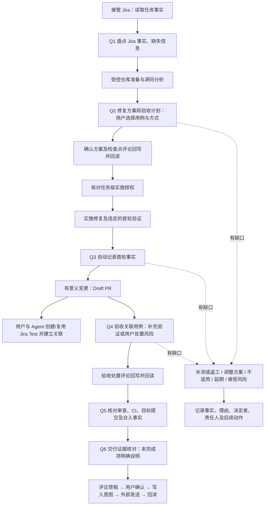

# 质量检查与证据

## 共同验证材料

使用现有 `quality.py apply --issue-key <key> --expected-run-id <run> --expected-revision <当前revision> --input <json> --dir <workspace>`，输入为 `{"action":"verification","payload":{...}}`。每个仓库分别提交材料，内部自动绑定当前任务各仓源码版本；不是新任务类型或执行引擎。写前先 `quality.py status`，source_sync 还会实际读取已准备的任务工作树并核对包含关系。原生报告的真实性、依赖清单和语义分析仍由 Agent 核对，工具不认证来源或判断断言含义。

所有材料提供 kind、repository、target_revision（当前完整 SHA 或首轮本地源码指纹）、source_ref。其余内容如下：

| kind | 材料 |
|---|---|
| local | analysis_ref（变更/用例缺口判断）、case_review_ref、case_version、dependency_analysis_ref；required_scope 列出全部应测模块及场景，results 对每项给出 scope、result、report_ref |
| ci | local 的相同范围及报告字段，加 run_ref、attempt 正整数、head_revision（本次 PR Head）、checkout_ref（实际测试源码及该 Head 的对应依据） |
| source_sync | source_branch（登记的检出来源）、source_revision（刚回读的来源 SHA）、before_merge_revision、observed_at、impact_analysis_ref；sync 由工具实际生成，用户输入不能代替 Git 核对 |
| review | complete=true 表示已完整分页回读；items 逐项记录 id、source_ref、reason、status（fixed/not_applicable/accepted_gap/pending），fixed 必须有 verification_ref；无意见使用空列表并保留回读来源 |

results 中 result 使用 PASS/FAIL/UNKNOWN/NOT_RUN/SKIPPED。PASS 另需报告中的 tests、failures、errors、skipped 非负整数，tests 必须大于零，其余必须为零。非 PASS 保留原结果；若研发明确接受该项缺口，提供 decision，包含 reason、uncovered（精确等于该 scope）、follow_up、proof（actor/source=user_message/reference/at）。不能用一项决定覆盖其它范围。review 的 accepted_gap 也提供这组明确处置。

跨仓 Jar 材料使用 jars 列表，每项包含 built_sha256、consumed_sha256（必须相同）和 loaded_from（实际加载证据）。local 另给 built_path、consumed_path 绝对路径，写入及检查点复核内容哈希；这两个路径仅保存为本地恢复元数据，不进入 Jira 摘要，其它材料仍按项目规则扫描。没有 Jar 时省略列表，但 dependency_analysis_ref 仍须说明分析依据。CI 使用运行内文件与加载证据，不冒充本地文件核验。报告引用、版本及统计从实际执行取得，不能为满足字段填造数字。

TapData 功能和缺陷使用相同配置：Q3、Q4 要求 local/source_sync，Q5、Q6 再要求 ci/review；PR Ready 要求 local/source_sync/ci，同时保留现有 PR Checks 和人工验收规则。代码、用例所在仓或依赖仓变化，报告失效；CI 重新观察后需重新核对并登记 CI 材料。本地 Jar 变化也失效。遗漏范围、未处理失败或待处理审查意见阻止对应检查点，人工接受的缺口保留原结果。

源码同步后已解决问题只需无修改重验时，`failures.py` 使用 revalidate，参数同 finish，不消耗修复轮数；失败则回到 unresolved，后续修改仍须 start 记账。每次重新验证都保留事件，不能改写历史。旧 `ci.py record-fix` 已移除，CI 观察不再维护另一套预算。

研发已手工处理未解决问题时，使用 manual_result，提供 finish 的实际结果/版本/报告字段，并附 reason 和真实用户消息 proof；不消耗自动修复轮数。仍有 running 轮次时先 finish 保留当时实际结果，再记录人工处理。没有明确人工来源或实际验证，不能声明恢复成功。

当前工位采用 epoch 4；材料只属于当前 run。旧状态由原版清理，新版本不迁移历史确认。生成/清理与跨版编排的顺序见[更新与回退](update-and-rollback.md)。发布、清理和业务验收分别授权。

## PR 审查返工

Agent 原生回读当前 PR Head、审查结论、普通评论和行内审查线程，读取完整分页；只读 PR 总体状态或只看最新一条评论不算意见收集完整。每条必要意见保留原始链接/ID、审查所针对提交、处理结论（已修复/说明不采纳/待研发决定）、理由、对应修改和验证。过时线程仍核对问题是否在当前代码存在，不能仅因 outdated 或线程已关闭就判为已解决。

在已确认预期和授权范围内直接修复、补用例并重验；不同意意见时给出代码/预期依据。验收含义改变、范围扩大或无法确定时交研发决策。只有具备明确外部评论授权时才回复 PR；本地可以先准备回复及证据，不擅自替审查人批准、关闭讨论或撤销请求修改。

审查指出与已有失败相同的问题时，使用 `failures.py` 的原 problem_id 和 stage=review 累计轮次，不新建预算。修改结束后重新核对检出来源、最终差异、本地测试及当前 PR CI；此前提交的批准或测试结果不能证明新提交仍满足要求。推送仍受当前任务授权限制。

Q5 前回读所有必要意见处理结论、当前 PR Head 的审查状态和 CI 报告。未决意见与研发接受的具体缺口分别记录，不能用一条总体“已处理”代替。缺少审查事实时保留未知，不能直接将 Q5/Q6 推进当作交付完成。研发处理后从当前环节继续，保留原提交、意见及验证记录；Jira 测试/处理总结引用对应意见和报告。

## 失败归因与有限修复

Agent 用原生工具分析失败。只有证据指向当前变更才自行修复；已有失败、环境问题及归因不明由研发决定。使用 `workflow/failures.py status --issue-key <key> --dir <workspace>` 回读当前 run 的失败记录，随后以 `apply --expected-run-id <run> --revision <读取的 revision> --input <事件.json>` 记录操作（同样携带 issue-key、dir）。输入保存在当前 run 的受控交互路径。

| action | 必需内容与含义 |
|---|---|
| observe | repository、稳定 check_id、label、attribution（current_change/preexisting/environment/unknown）、evidence；创建或更新问题，返回 problem_id |
| start | problem_id、stage（local/ci/review）；修改前占用一轮，包含本轮分析、修改、重验 |
| finish | problem_id、result（PASS/FAIL/UNKNOWN/NOT_RUN/SKIPPED）、source_revision、evidence；使用实际版本及报告，未执行如实说明 |
| decide | problem_id、decision、reason、proof；continue 另给 additional_rounds 正整数，accept_gap 另给 uncovered 与 follow_up |

`proof` 使用已有用户消息来源字段 actor、source=user_message、reference 和带时区 at，引用研发真实决定，不是身份认证。人工追加明确限定从当前累计次数起可再试几轮；接受缺口保留 accepted_gap，不写 PASS。环境问题由研发授权 Agent 处理时，也明确续修轮数。

同一问题以首次关联的 repository/check_id 定位，label 改名不改变身份；本地、PR CI、审查和恢复共用累计三轮，不因成功后再次出现而清零。Agent 必须将相同根因的后续失败关联原检查项，不能通过新建 check_id 绕开次数；工具不猜测语义上是否为同一根因。源文件或用例改名时仍使用原 check_id。中断中的轮次先以真实结果（包括 UNKNOWN/NOT_RUN）finish，不重开不记账；事实或范围变化则重新 observe 并核对人工决定是否仍适用。

记录按任务 run 隔离、带 revision 并持锁更新；重放保留归因、每轮来源及结果、决定和报告。新增失败文件不改写已有任务或 CI 文件；接入阶段检查点前，记录本身不代表流程已经强制检查全部失败，也不代替 PR Checks 或 Q4 验收。

质量检查采用“必须核对、用户决定处置”的方式。Agent 提议验收用例及验证方式，用户选择；测试工具提供执行结果，用户决定是否验收、补测、不适用、延期或接受风险。接受风险不会把失败或未执行改为通过。

本文说明稳定操作方式。项目标准来自 `projects/<project>/quality.json` 和 `admission.json`，输入及恢复契约来自 `contracts/quality-action.schema.json`、`quality-state.schema.json`。工作项与最终证据仍在 Jira；本地记录只是任务 run 的执行及恢复材料。[任务授权](task-authorization.md)和[安全边界](../security/permissions.md)独立生效。

Agent 为 Jira/MCP 调用和质量动作准备的 JSON 输入、草稿、回执、回读或日志，先通过下列命令取得当前 run 的受控路径，不要直接写入 `.agenticops/` 根目录：

```sh
interaction_file="$(python3 <agenticops-root>/workflow/task.py interaction-path \
  --issue-key "$task_key" --expected-run-id "$task_run" \
  --name jira-snapshot.json --dir "$project_workspace")"
```

文件名使用 lowercase-kebab-case，可选扩展名 json/jsonl/log/md/txt。interaction-path 返回 `.agenticops/evidence/interactions/` 内路径，仅当前 run 可写；归档后停止开发，release/clean 收尾移除活动副本，档案保留必要脱敏材料。不用根目录文件名前缀模拟任务归属。

旧状态不在线迁移或猜测归属；退出当前任务后，明确 workspace purge 注销受管状态，再按新版本生成。未知残留阻止清理；需保留材料先导出核验。见[更新与回退](update-and-rollback.md)。

## 任务类型与质量配置

任务类型可在 Project 的 `admission.json` 中声明 `quality_profile`，值为当前项目目录内的 JSON 文件名，例如 `quality-feature.json`。未声明时沿用 `quality.json`，保留现有缺陷规则及摘要算法。显式声明的文件缺失、配置无效或未启用当前任务类型时，相关质量检查拒绝推进，不回退到缺陷规则。质量配置选择统一用于授权、阶段、证据、PR Ready 及同步告警。

专用配置复用现有质量合同，通过 `task_classes` 声明适用类型，通过 `intake_fact_keys` 和 `plan_fact_keys` 声明参与确认的事实。实施前必须包含人工决定的 `q1-intake` 与 `selection_checkpoint`。未使用既有 `structured_fix_plan` 检查时，必须以 `plan_contract` 声明方案对象的 `fact_key` 和非空 `required_fields` 列表；该事实同时列入 `plan_fact_keys` 并登记为准入配置中的已知事实。`task.py record --key <方案事实> --input <JSON文件>` 可以记录此对象。这里只检查必要内容存在和确认有效性，方案合理性及测试预期仍由 Agent 与研发核对。

任务专用方案摘要绑定任务类型和配置指定的方案事实；授权签发、续签及推进使用同一选择。已确认的方案、验收或规则实质变化后，重新核对相关确认；未参与确认的展示备注不影响方案。没有启用质量检查的任务不能签发方案授权，不能通过空配置代替检查。增加配置支持不等于功能任务已完成 Jira 或真实测试接入。

本次能力扩展不增加本地状态字段、路径或事件格式，`workspace_state_epoch` 保持 1。未启用专用配置的旧缺陷任务继续使用原规则及相同摘要；旧事件按记录的规则重放。给已有任务切换质量配置属于规则变化，旧确认不会自动迁移为新规则下的确认。专用配置须部署在支持此能力的产品版本；回退旧产品前结束或停用这些任务，不能将新能力下的任务当作已验证的旧版续办路径。

## 流程与检查点

TapData 功能开发使用 `quality-feature.json` 与 `implementation_plan`，Q2 绑定目标、实现变化、验收场景、风险、回滚及范围；不要求缺陷根因。CI 用例在功能任务内维护，不要求独立 Jira Test；实际关联的 Test 仍按当前用例版本与方式核对。Q4 必须有当前代码的验收证据，不能因为无独立测试任务而省略验证。下图中的修复方案和修复步骤，对功能分别对应实施方案与功能实现。

功能 Jira 协作遵循“先读事实、处理过程中补充、按阶段回填、流转后回读”，见[项目任务引导](../../projects/tapdata/skills/tapdata-task/SKILL.md#功能任务的-jira-协作)。Story 与缺陷复用 `jira_status.py prepare/complete`，项目 `status_sync.by_task_class` 分别配置流转和字段采集提示，避免套用缺陷规则。已知未发起转换的预检缺项可补齐后重检；已发起写入的 failed/unknown 先回读，不自动重放。现有状态格式不变，旧记录继续保留。配置支持不等于真实完整交付已验收。



| 检查点 | 核对内容 | 当前阶段强制点 |
|---|---|---|
| Q1 接管与盘点 | Jira 任务事实和缺失信息；接管不要求预先存在 Test | Q1、Q2 的用户处置在进入 `implementation` 前检查；缺普通信息可先分析，仓库基线与权限仍须可靠 |
| Q2 方案与验收 | 已验证事实、根因假设、缺失输入、修复范围、验收场景、每项预期和方式，以及 Test 复用/创建关联意图 | 只有无关键缺口且用户确认后才可签发并进入 `implementation`；Test 的定义和编写由用户与 Agent 处理 |
| Q3 首轮验证与 Draft PR | Q2 已选的全部修复后检查项在最终完整 SHA 上的首轮结果、可审阅变更和风险 | 自动事实检查点，不再重复要求用户接受首轮验证；任一结果不符合预期、证据不完整时停止相应验收；评论回读不明仅记警告 |
| Q4 关联用例验收 | 编码后 Jira「已链接工作项」中的 Test、Test Type、用例版本、当前代码、执行证据和用户逐项确认 | 进入 `ci_validation` 前；只有全部受管用例 PASS 才可尝试 Tests Passed |
| Q5 审查及 CI | PR 仓库与 Head、检查结果、目标用例是否运行、审查或合入的回读事实 | Q5、Q6 在本地 `completed` 前 |
| Q6 交付证据 | 已完成和待完成事项、风险责任、Jira/发布事实及后续接力 | 本地完成仅代表本轮执行结束，不能据此声称 Jira Done 或已发布 |

首个有意义提交并完成第一轮针对性验证后建议创建 Draft PR。若验证受阻，披露现状并按 TapData 标准中首个有意义提交／一个工作日要求处理；不等待全量验证全绿。正式提审与 Jira `PR Submitted` 仍遵循 `Tests Passed` 等外部条件。

## 非阻断修复策略

规范化类型为 `defect_fix` 的任务在 Q1 只读显示当前修复策略，健康默认配置为“最小充分修复（默认，可在 Q2 前调整）”。默认路径不要求用户选择、确认、执行命令或填写 Jira 字段。Q2 前先读取 `task.py checklist --json` 或 `task.py next` 返回的 `repair_strategy`，用其中 `planning_guidance` 生成方案，并在现有 Q2 确认内容中说明策略如何影响修改范围；策略定义以 `policies/defect-repair-strategies.json` 为通用事实源，项目只可通过 `projects/<project>/planning.json` 覆盖默认选择。

修复策略只是 advisory 调优：配置缺失或损坏、任务覆盖失效、Agent 未记录应用情况或方案偏离都只形成 warning，不进入 `quality.py` problems、`task.py advance` blockers、Gate 或 Authorization 必填绑定。公司目录无法读取时停用本次调优并继续原缺陷流程，不在代码中复制另一份策略正文。功能、技术及未知类型任务不解析、不展示也不保存修复策略。

用户可在 Q2 确认前使用 `task.py repair-strategy list/show/set/clear` 查看或调整当前 run；`set/clear` 必须绑定 `--expected-run-id`。Q2 已确认后不能只改偏好而保留旧方案，需要让新策略作用于当前任务时，更新 `fix_plan` 并沿用现有重新规划、Q2 确认和授权流程。此时重新确认由实际方案变化触发，不是策略门禁。

以上是现有 `task.py advance` 的强制检查点。Q2 的 `fix_plan` 必须以 `structured-v1` JSON 记录：每个问题现象及来源、可回查证据、可证伪假设、未取得的关键输入、修改范围、风险、回滚以及每个验收项的 Test 关联意图。缺输入时只输出一次性材料清单，不得签发授权或将假设称为根因。`case_status=existing` 表示复用已回读的 Test，必须保留 Jira 来源；`case_status=proposed` 表示确认创建并关联的意图，必须提供步骤、预期、方式和责任人。Q4 才回读真实关联、版本和执行结果；计划创建的 Test 在创建后补入真实 key/version 不会推翻 Q2 的创建意图。Q3 只在全部已确认的修复后检查项已有当前完整 SHA 的预期结果时使用 `auto_checkpoint` 记录事实并回写 Jira。它不等同于用户验收，也不能在失败、跳过、未知、计划变化时推进。原生工具由平台权限处理；Workflow 只保证不满足条件不能推进。advance 需要 expected-run-id 和 expected-stage；Jira prepare/complete 需要 expected-run-id，均从当前 task.py status 固定。不要跳过 Workflow，也不要因本地处置而绕过服务端 Validator 或保护分支。

## 非阻断 Jira 状态同步

初始化后先用 `task.py snapshot --issue-key <issue> --expected-run-id <run> --input <snapshot.json> --dir <workspace>` 保存已读的 issue/source_ref。该入口同 run 幂等，独立于水印、Jira 权限和产品版本查询；后续本地普通事实由 record 维护，在相关检查点确认。

接管时复用一次 Jira 初始快照，`jira_watermark.py prepare` 保存本地初始事实和产品版本，再准备原生回写。失败或未知结果记录为同步待办，允许推进 task_intake；未知写入先回读，同 run 恢复不重复导入或覆盖初始事实。

缺陷进入 `task_intake` 后，Agent 立即读取当前 Jira issue、当前用户和可用 transitions，以 `takeover` 节点执行一次 `jira_status.py prepare`。当前状态已是 `In Progress` 时直接记录；当前状态为 `Analyzed`、Assignee 为当前用户且 Jira 返回配置的 transition 时，工具生成精确 transition 意图，Agent 当场调用原生 Jira 工具一次并用 `complete` 导入回读。状态不匹配、必填字段缺失、权限或外部调用失败只记录和提示，不回退本地阶段、不重试。

Q4 有效确认并进入 `ci_validation` 后，以 `tests_passed` 节点执行相同步骤。接管阶段不要求创建 Test；编码完成后由用户与 Agent 根据已确认的验收方案创建或复用 Test，并通过「已链接工作项」关联缺陷。只有当前状态为 `In Progress`、Q4 总体处置为 `accept`、全部受管 Test 均有当前完整提交 SHA 的 PASS 证据且用户逐项 `accept`、并且 Jira 返回目标 transition 时才生成意图。`Pull Request Submitted` 不自动执行。

输入由 Agent 从 Jira 实时读取，至少包含任务、字段、当前用户、可用 transitions 和可回查来源：

```json
{
  "source_ref": "可回查的 Jira 读取来源",
  "current_user": {"accountId": "当前 Jira 用户 accountId"},
  "issue": {"key": "TAP-123", "fields": {"status": {"id": "状态 ID", "name": "Analyzed"}, "assignee": {"accountId": "当前 Jira 用户 accountId"}, "issuelinks": []}},
  "linked_test_details": [
    {"key": "TAP-TEST-1", "test_type": "Manual", "case_version": "Jira updated 或 Xray 版本引用", "source_ref": "该 Test Details 的可回查 Jira 来源"}
  ],
  "transitions": [{"id": "421", "name": "Start Investigation", "to": {"id": "目标状态 ID", "name": "In Progress"}, "fields": {}}]
}
```

`linked_test_details` 只在 Tests Passed 或 PR Ready 核对时必需：它是 Agent 从 Jira/Xray Test Details 读取的事实，不由 AgenticOps 推断或写入。无法读取时，工具会要求用户提供关联 Test key、Test Type、用例版本引用和 Jira 来源。`Manual`、`TapTest`、`Unit` 是当前受管类型；`TapCE` 显式忽略但不算通过。若只有 TapCE、类型不支持、关联缺失或 Jira Validator 仍要求 TapCE，用户调整 Jira 或验收方案后重新读取并重做预检；不得盲目重放已经发起的 Jira 状态转换。

```sh
python3 "$agenticops_root/workflow/jira_status.py" prepare --expected-run-id "$task_run" \
  --issue-key "$task_key" --trigger takeover --input "$jira_snapshot" --dir "$project_workspace"

python3 "$agenticops_root/workflow/jira_status.py" complete --expected-run-id "$task_run" \
  --issue-key "$task_key" --trigger takeover --outcome failed \
  --input "$jira_readback" --message "Jira 原始错误摘要" --dir "$project_workspace"
```

`prepare.outcome=ready` 时只使用返回的 `transition_id` 调用一次原生 Jira transition；这是 Agent 协作约定，Workflow 不拦截原生调用。调用超时或结果不明时先回读；已到目标状态由 `complete` 记为成功，否则按 `unknown` 记录，不盲目重放。同一 run 的同一节点再次 prepare 只返回原记录。

转换 metadata 标记的必填字段为空时，`prepare` 不尝试写入，按 Project `field_mappings` 输出字段名、采集时机、本地来源是否已具备、可否自动填写和处理方式。根因、Module、Tester、测试设计结论、Xray 和测试例外等专业事实不能由 Agent 猜测；可从本地已确认方案和证据形成填写依据，但必须由责任人确认后在 Jira/Xray 补齐并回读。当前节点不重新尝试，最终在 PR Ready 输出人工待办。

| Jira 目标状态 | Jira 属性或关系 | 本地任务映射 | 处理时机与边界 |
|---|---|---|---|
| `In Progress` | Assignee / Engineering DRI | 无可替代的本地事实 | 接管前核对当前 Jira 用户与 Assignee；不一致不改派，跳过转换 |
| `Tests Passed` | Issue Classification、Root Cause Category | `facts.fix_plan` 仅提供已确认根因依据 | Q2 形成；Jira 枚举值由责任人选择，不从文本猜测 |
| `Tests Passed` | Module | 任务 `repositories` 与问题归属证据 | 目标仓库确认时形成；映射不唯一时人工选择最终一级 Module |
| `Tests Passed` | Issue Analysis | `facts.fix_plan`、Q2 已回读评论 | Q2 后补失效机制、触发条件、影响与证据，不生成未确认结论 |
| `Tests Passed` | Fix Details | `facts.fix_plan`、实际提交、Q4 验证 | 实现与验收后补处理方式、结果、边界和限制；计划不能冒充完成事实 |
| `Tests Passed` | Tester、Test can be automated | Q2 验收方案及实际责任人 | 由责任人确认；手工用例可选 `No`，但不等于免测 |
| `Tests Passed` | Fix Version | `facts.issue_version_plan` 只提供版本与修复线依据 | Tests Passed 前选择实际交付版本；不得把分支名或影响版本猜成 Jira 选项 ID |
| `Tests Passed` | Xray Test 关联 | Q1-Q4 检查项和 Jira「已链接工作项」中的 Test 任务 | 正常路径至少关联一项正式 Test 任务；每项均需以 PASS 执行证据获得用户 `accept` 确认，本地检查项不能替代 Jira 关联 |
| `Tests Passed` | Test Coverage Decision / Exception Details | 无默认本地自动值 | 仅在合规 T3 低风险例外获批后人工填写；否则不能借例外绕过测试 |

转换面板实时返回的 required fields 是本次尝试的最终事实源；上表用于提前采集和解释，不覆盖 Jira Workflow。若本地来源已具备，Agent 引导责任人据此回填；若来源缺失、值需专业判断、选项 ID 无法可靠解析或写后回读不一致，就跳过本节点转换，保留具体字段和 Jira 原始错误的脱敏摘要，在 PR Ready 一次列全人工事项。

## PR Ready 核对

正式提审前，先为每个任务仓库记录 PR，并使用 `ci.py watch` 取得当前 PR Head 的最新 Checks。Agent 同时从 Jira 读取当前任务 `fields.issuelinks` 与每个关联 Test 的 Test Details：只接受 Project 配置的关系（TapData 缺陷侧为 `tests`）指向、且任务类型为 `Test` 的关联项，输入 `pr_ready.py`：

```json
{
  "source_ref": "可回查的 Jira 读取来源",
  "issue": {
    "key": "TAP-123",
    "fields": {
      "issuelinks": [
        {
          "type": {"outward": "tests"},
          "outwardIssue": {
            "key": "TAP-TEST-1",
            "fields": {"issuetype": {"name": "Test"}}
          }
        }
      ]
    }
  },
  "linked_test_details": [
    {"key": "TAP-TEST-1", "test_type": "Manual", "case_version": "Jira updated 或 Xray 版本引用", "source_ref": "该 Test Details 的可回查 Jira 来源"}
  ]
}
```

```sh
python3 "$agenticops_root/workflow/pr_ready.py" \
  --issue-key "$task_key" --jira-input "$jira_test_tasks" --dir "$project_workspace"
```

工具只在以下三组均通过时返回 ready：从 Jira「已链接工作项」派生的受管 Test 非空，每个 Test 的 Test Type 与用例版本可回读，且每个 Test 都在 Q4 以同一 `case_ref`、当前 Jira 用例版本和对应方式建立检查项，并由用户基于当前 SHA 的 PASS 执行证据逐项作出 `accept` 确认；每个任务仓库都记录 PR，最新 Checks 为 `success` 且 Head 等于当前任务代码；Q1-Q4 及其检查项均有效，Jira 评论同步仅列警告。Jira Test 工作项本身不要求为 Done。没有符合关系和类型的 Test、未逐项确认、Checks 为空、跳过、未知、等待或失败、Head 漂移、`defer/accept_risk/rework` 都会列为待办。`Test Coverage Decision / Exception Details` 只能记录合规例外，不能替代 Test 关联。Jira 状态同步失败单独列入 `jira_status_todos`，不改变三类验收事实；Engineering DRI 处理待办后重新核对，并手工执行 `Pull Request Submitted`。

## 影响版本与优先修复线

任务开始保留一次 Jira 初始快照；本次采用的版本由用户确认并记录在本地，后续读取不覆盖它。版本名称不映射 Git 分支。先核验 develop，存在同一缺陷时优先在 develop 修复；否则独立确认一条真实实施分支。只核验优先分析分支与实际选择分支，其它受影响版本的合并与验证列为后续事项。

用 `task.py issue-versions --issue-key <issue> --expected-run-id <run> --input <json> --dir <workspace>` 导入；source_ref、完整 SHA 和确认来源必须来自实际记录：

```json
{
  "issue": {"key": "TAP-123", "fields": {"versions": [{"id": "1001", "name": "v4.22"}]}},
  "source_ref": "Jira 初始读取来源",
  "develop": {"status": "present", "revision": "完整 SHA", "source_ref": "源码或复现证据"},
  "effective": {
    "versions": [{"name": "4.22.0"}],
    "execution_branch": "develop",
    "release_follow_up": "其它影响版本的合并与验证待确认",
    "proof": {"actor": "实际确认人", "source": "user_message", "reference": "真实用户回复", "at": "2026-09-07T10:00:00+08:00"}
  }
}
```

effective.versions 无需 Jira ID。省略时采用初始版本，但仍需用户确认实施分支及来源。相同 run 的再次导入保留初始 observed，可在设计阶段修正版本；已准备的分支和 base_sha 必须保持一致。实际修复线改变仍需归档清理后重接并重新确认。版本差异进入同步警告，下一次 Jira 评论说明；不能把本地修正声称为 Jira 字段已更新。

用输出的 `primary_branch` 进行产品分支对齐，模块按其对齐结果准备，不把主仓分支名套给所有模块。TapData 的 `--tapdata-root` 指包含模块仓库的产品目录；`hazelcast` 固定参与并使用 `release-v5.5.0`。版本核验不改变 source 或当前分支。

## 检查项、执行及决定

一个检查点可以有多个检查项；一个检查项只能对应一个用例和一种验证方式。需要两种方式时建两个检查项。同一用例可用于修复前、后两个检查项，各自写明预期，保留独立证据。

- `plan`：稳定检查项 ID、检查点、`before_fix/after_fix`、用例引用及版本、`existing/proposed`、单一方式、仓库、目标代码版本、范围、预期及 `expected_result`。
- `executions`：可有多次执行；每次保留唯一编号、用例与代码版本、环境、来源、报告引用、观察时间、观察内容和原始结果。重试用新编号，不覆盖历史。
- `selection`：用户选择了该用例和方式的来源记录。先展示用例、预期、时机、成本与可行性，再记录用户选择；摘要哈希不是用户审批对象。
- `decision`：用户针对当前证据的处置、理由和确认来源。通过需明确选择当前用例及代码最后一条适用执行；计划变更及新证据使相关旧确认失效。
- `auto_checkpoint`：仅供 Project 标记为自动的检查点使用；它不接受伪造的用户确认，要求全部已选修复后项在当前完整提交 SHA 上有预期原始结果。TapData 的 Q3 据此记录首轮事实；Q4 仍需用户对关联 Test 的最终验收。

Q2 前通过 `task.py record --key fix_plan --value "根因、范围、修复方式、风险及回滚"` 保存实际方案，使确认和 Jira 回写包含修复内容而不只是测试清单。手工用例必须提供可操作 `steps`。修复后计划可先填 `target_revision: pending`，执行前用 `item` 更新为精确代码；只更新该字段不使已选用例失效，但会使该项旧执行处置失效。步骤、用例、方式、预期或范围实质变化仍需重新选择。

手工执行导入不接受分支名、短 SHA 或工作区占位符，必须绑定完整提交 SHA。首轮本地 Maven 自动验证允许 `git_revision` 的精确工作区指纹，以支持提交前测试；Q4 起的通过处置必须绑定完整提交。提交后须重新核对/执行，不能仅把旧报告版本字段改成新 SHA。实际测试在旧 SHA 时保留原证据并明确缺口，不能冒充当前提交已验证。

修复前不能执行时可以保留 `NOT_RUN`，解释原因并由用户延期、调整计划或接受风险。修复后项在 Q2 是 `not_due`，不能误报为缺失或失败。修改时机通过 `item` 更新并写理由，原计划保留在事件日志，新计划需要重新选择。

`PASS / FAIL / SKIPPED / NOT_RUN / UNKNOWN` 是原始执行结果。修复前复现可预期 `FAIL`，但必须是已确认符合目标故障的断言失败；环境失败不能算复现成功。用户认可复现不会把原始 `FAIL` 改名为 `PASS`。

| 处置 | 必需内容与效果 |
|---|---|
| `accept` | 理由、确认来源、`evidence_id`；实际结果满足预期，不能选过时、跳过或未知执行冒充通过 |
| `rework` | 理由、责任人、后续动作；当前检查点保持未解决 |
| `not_applicable` | 理由及确认来源；明确不适用，保留已有结果 |
| `defer` | 理由、责任人、后续动作及晚于确认时间的带时区期限；到期再推进时须重新处置 |
| `accept_risk` | 理由、责任人、后续动作及确认来源；允许带风险继续，保留失败／未执行事实 |

每个已到期项都要有处置，不能用一句“全部同意”隐去未解决项。检查点也要确认整体事实与缺口。没有任何用例时，Q2 之后不能声明验收通过，需要明确不适用或风险决定。用户最终决定验证方式，但无权通过本地质量记录绕过独立权限、合并、发布或 Jira Validator。

## 与测试结果联动

| 验证方式 | 执行来源 | 关联方式 |
|---|---|---|
| `taptest` | `taptest` | 从 `t-layer3-test` 读取 `write-xray-test`、`write-test-script` 的实际能力；由原生 Agent 使用技能生成／实现，导入具体 Xray Test Execution、报告、版本与单用例结果 |
| `unit` | `local_maven` 或 `ci` | 对应 Jira Test Type `Unit`；已有覆盖则复用，新覆盖由用户与 Agent 在所属产品模块工程实现；核对实际 class/method、报告、产品提交、测试版本、CI run/attempt |
| `manual` | `manual` | 用户选定的真实手工用例、执行人、环境、步骤预期及观察结果，关联可回查附件／评论 |
| `other` | `external` | 用户批准的其它方式；用例中明确方法细节，并导入其执行证据 |

AO 不新增测试执行器或测试平台客户端。Agent 用现有工具读取结果，或记录用户提供的证据，再通过 `execute` 导入。导入是对来源的记录，不能独立认证外部结果；验收时必须展示来源并请用户确认。报告不能映射到具体用例时保留 `UNKNOWN`。

本地 Maven 与 CI 是同一集成测试方式的不同执行来源。`ci.py watch` 只观察 PR 返回的检查，绿色不证明目标集成用例运行；必须核对路径过滤、矩阵、跳过条件及测试报告。未知、空检查、跳过均不会被当作成功。CI 记录按任务、run、仓库和 PR 隔离，旧版无身份记录不作为当前证据。

公司 wiki 索引在项目 `quality.json`；目标分支的代码、POM 和 CI 是实现事实源。Failsafe 项目在核对配置后可使用 Project Runbook 指定的 Maven 命令运行 `test-compile failsafe:integration-test failsafe:verify -DskipITs=false`，指定用例用 `-Dit.test=Class#method`；Runbook 指定任务本地仓库时不得退回裸 `mvn` 或共享缓存。`mvn test` 或仅编译成功不能证明该集成用例已执行，先核对实际模块及报告。

## 操作接口

首先使用 `task.py` 建立任务、登记仓库，再读取质量快照：

```sh
python3 "$agenticops_root/workflow/quality.py" status \
  --dir "$project_workspace" --issue-key "$task_key"
```

`status` 返回当前 `run_id/revision`、项目方式、缺失事实、各项计划及证据、检查点的 `due/not_due/problems`、具体 `handoff`、评论是否 `published` 和确认所需 digest。`task.py next --issue-key <issue> --dir <workspace>` 汇总下一阶段门禁、检查点和待回读评论，只读且不授予权限。每次写入从最新快照取得版本，避免覆盖别人的决定：

```sh
python3 "$agenticops_root/workflow/quality.py" apply \
  --dir "$project_workspace" --issue-key "$task_key" \
  --expected-run-id "$run_id" --expected-revision "$revision" \
  --input "$quality_input"
```

`quality_input` 是普通 JSON 文件，格式为 `{"action":"操作名","payload":{...}}`。完整字段、枚举和必需内容见契约；不接受未声明字段。以下是单项用户选择，`proof` 必须来自真实用户回复，不能由 Agent 编造：

```json
{
  "action": "select",
  "payload": {
    "item_id": "regression-1",
    "digest": "status 返回的该项 plan_digest",
    "proof": {
      "actor": "实际决定者",
      "source": "user_message",
      "reference": "可回查的用户回复引用",
      "at": "2026-09-03T10:00:00+08:00"
    }
  }
}
```

| action | payload 主要字段 |
|---|---|
| `item` | `plan`、变更 `reason`；更新同 ID 需重新核对受影响确认 |
| `select` | `item_id`、`plan_digest` 对应的 `digest`、`proof` |
| `execute` | `item_id`、`execution`；导入一次实际执行或未执行说明 |
| `decide` | `item_id`、当前项 `digest`、`decision` |
| `checkpoint` | `checkpoint`、当前检查点 `digest`、`decision` |
| `auto_checkpoint` | 自动检查点、当前 `automatic_digest`、事实理由；不携带用户 proof |
| `draft` | `id`、准确 `body`；检查点回写还需 `checkpoint`，正文必须是该点的 `publication_body` |
| `confirm` | 草稿 `id/digest/proof`；确认完整正文及目标 Jira |
| `prepare_write` | 草稿 `id/digest`；成功保存后返回 `operation_id` 与 `intent` |
| `receipt` | `id/operation_id/result`；`created` 必须有 `comment_id`；已知未写入记 `deferred` 并给 `reason`，不明结果记 `unknown` |
| `readback` | `id/operation_id/site/issue_key/comment_id/body/source_ref`；匹配后才为 `verified` |

`proof.source` 支持 `user_message/jira_comment/review`，必须包含决定者、来源引用和带时区时间。该记录提供审计出处，不提供用户身份认证或密码学签名。平台和服务器权限负责外部操作，Workflow 在检查点核验记录。

## 回写和恢复

TapData 每个检查点确认后尽力回写 Jira，评论失败或未回读仅产生警告，不阻止阶段推进或 PR Ready。使用 status 返回的简洁 publication_body；完整结构化证据保存在本地。真实测试、方案确认及必要验收条件仍须满足。

方案确认时一并告知用户将把 Q1/Q2、合格的 Q3 首轮事实和最终 Q4 内容回写 Jira。用户可在同一真实回复确认方案、验收方式、任务授权及合格 Q3 的自动回写/推送/Draft PR；该回复可被引用完成多项选择和评论确认，不要求逐条回复。Q4 仍须基于当前 SHA 的关联 Test 证据请求最终验收。若内容、授权范围或风险发生实质变化，再请求缺少的决定；不能由 Agent 自行编造用户同意。每个步骤成功后继续已授权编码、验证、提交/推送、PR、CI 和回写，不把一次工具成功当作最终停点。合并、发布等独立授权边界不变。

确需停下时，必须解释当前检查点要核对什么，并把 `handoff` 转成用户可执行的说明：用例/步骤、预期、执行人、环境、仓库及完整 SHA，要求返回日志/报告与实际结果，列出可选处置和仍可继续的工作。缺少 SHA 的日志先补来源，不猜目标版本；恢复同一 run 时不重复问已有效确认的问题。

`evidence.py` 生成可审阅证据摘要。将准备发送的精确正文保存为草稿，展示给用户确认后，先 `prepare_write`，再由原生 Jira 工具发送，随后导入回执和回读。`verified` 仅代表该评论的目标、编号和正文匹配，不代表 Jira 状态流转或任务发布完成。Markdown／ADF 被外部工具规范化时应使用双方一致的正文表示；不匹配时保留现场，不能忽略差异宣布成功。

发送前正文或关联质量快照变化，会使确认失效。检查点评论只绑定该点快照和处置，后续无关阶段不使它失效；普通汇总草稿仍绑定整体快照。拿到意图后发生超时或中断，先回读核对，不重复调用新增评论。未拿到评论 ID 时只能通过可核实的原始请求与远端记录定位；多个同文评论无法消歧时人工接力。`operation_id` 是本地关联编号，不是 Jira 服务端幂等键。

日志按当前 task/run 隔离，追加操作复用任务锁、revision 比对、原子替换和持久化。旧 revision、错误 run、损坏或未知版本不会覆盖原记录。实际代码变化、相关仓库 CI 变化或用例／方式／预期变化使相应确认失效；工作目录指纹只保存摘要，不保存源码。修复前复现仍绑定原版本，不因开始修复而丢失。

Q1 仅绑定准入事实和已到期项；Q2 绑定修复方案、稳定用例选择及修复前处置，不绑定修复后 SHA、执行结果或 CI。后续编码、验证结果、PR 编号和 verification 文本不会迫使用户重复确认 Q1/Q2；实质方案或准入事实变化仍使相关确认失效。验收点仍随目标代码及相应证据变化而失效。历史事件按其记录时的规则重放，新规则不改写旧证据；升级后旧规则下的确认需按当前快照核对，不能静默伪造迁移。

受控 cleanup 在成功移除干净工作树时保存 `final_revision`，质量快照继续核对该提交，避免仅因移除了工作目录便让验收确认失效。移除前代码已变化仍会失效；旧记录缺少最终 SHA 时不能猜测补齐。

清理后重接的新 run 不继承旧验收；旧未知评论只作为原档案证据，不借新 run 重发。恢复未知外部调用必须核对原操作，不删除账本消除未知结果。

接管进入 `task_intake` 后尝试一次 `Analyzed → In Progress`，Q4 验收完成并进入 `ci_validation` 后尝试一次 `In Progress → Tests Passed`。每次都先读取 Jira 当前状态、可用转换和转换必填字段；状态不匹配、字段补不了、权限不足或外部调用失败时记录人工指引并继续本地主流程，不重试，也不影响后续节点按各自事实再尝试。附件规定与线上 Validator 若不一致，应报告并以实时 Workflow 为准；手工用例仍是用例，不能冒充缺陷免测。`Pull Request Submitted`、实际合并、发布和 `Done` 仍分别以标准流程及外部事实人工确认。

本地 `accept_risk` 不等于公司的免测批准。T3 标准中的低风险例外仍需核对优先级、替代验证、责任和回滚措施，以及规定的模块负责人和审批人批准；P0/P1、数据安全、权限或高可用等要求不得据此自动豁免。发生冲突时先报告用户并确认后续处理，保留 Jira 的真实状态。

Jira 评论采用简洁可读文本。当前 Rovo addCommentToJiraIssue 的 commentBody 为 Markdown 字符串，不接受直接传入 ADF 对象；不增加重复 Jira 客户端。正文只规范化 CRLF 和行尾空白，仍核对完整可见文本与目标、评论编号。短标识用于定位，不独立证明内容正确；若工具返回 ADF，由无状态协议转换提取文本，不能靠猜测反转义伪造回读。

每个阶段均可运行 task.py next 查看 blockers 与 warnings，PR 提交后运行 evidence.py 汇总执行过程被跳过的处理与警告。外部同步失败只暂停该写入或重复尝试，完整测试、CI 和用户验收条件继续由检查点核验。

字段写入成功后，用 `external_sync.py status --issue-key <issue> --dir <workspace>` 获取本地 fact_digests，再以 `readback --expected-run-id <run> --input <json>` 导入 `{fact_key, expected_fact_digest, jira_field, issue, source_ref}`。issue 是实际 Jira 回读，字段必须与本地有效值一致；problem_version 按配置的影响版本字段核对版本名称，不要求本地有 Jira ID。同步回执单独持久化，不改变原始快照、方案确认和阶段；本地事实再次改变后旧回执失效。
