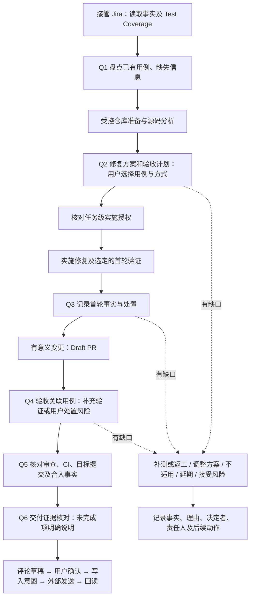

# 质量检查与证据

质量检查采用“必须核对、用户决定处置”的方式。Agent 提议验收用例及验证方式，用户选择；测试工具提供执行结果，用户决定是否验收、补测、不适用、延期或接受风险。接受风险不会把失败或未执行改为通过。

本文说明稳定操作方式。项目标准来自 `projects/<project>/quality.json` 和 `admission.json`，输入及恢复契约来自 `contracts/quality-action.schema.json`、`quality-state.schema.json`。工作项与最终证据仍在 Jira；本地记录只是任务 run 的执行及恢复材料。[任务授权](task-authorization.md)和[安全边界](../security/permissions.md)独立生效。

## 流程与检查点



| 检查点 | 核对内容 | 当前阶段强制点 |
|---|---|---|
| Q1 接管与盘点 | Jira 事实、已有 Test Coverage、用例覆盖和缺口 | Q1、Q2 的用户处置在进入 `implementation` 前检查；缺普通信息可先分析，仓库基线与权限仍须可靠 |
| Q2 方案与验收 | 根因、修复范围、复用或新增用例、每项预期和方式、修复前复现 | 进入 `implementation` 前核对全部方案已被选择；修复后项可尚未执行 |
| Q3 首轮验证与 Draft PR | 第一轮结果、可审阅变更、未完成验证及风险 | 进入 `pr_review` 前；完整回归可以安排在 Q4 |
| Q4 关联用例验收 | 当前代码、用例版本、选定执行、期望符合情况、风险处置 | 进入 `ci_validation` 前 |
| Q5 审查及 CI | PR 仓库与 Head、检查结果、目标用例是否运行、审查或合入的回读事实 | Q5、Q6 在本地 `completed` 前 |
| Q6 交付证据 | 已完成和待完成事项、风险责任、Jira/发布事实及后续接力 | 本地完成仅代表本轮执行结束，不能据此声称 Jira Done 或已发布 |

首个有意义提交并完成第一轮针对性验证后建议创建 Draft PR。若验证受阻，披露现状并按 TapData 标准中首个有意义提交／一个工作日要求处理；不等待全量验证全绿。正式提审与 Jira `PR Submitted` 仍遵循 `Tests Passed` 等外部条件。

以上是现有 `task.py advance` 的强制检查点。Hook 继续执行既有操作授权和安全策略；本版不宣称拦截任意工具绕开 Workflow 的每一次质量相关操作。不要跳过 Workflow，也不要因本地处置而绕过服务端 Validator 或保护分支。

## 检查项、执行及决定

一个检查点可以有多个检查项；一个检查项只能对应一个用例和一种验证方式。需要两种方式时建两个检查项。同一用例可用于修复前、后两个检查项，各自写明预期，保留独立证据。

- `plan`：稳定检查项 ID、检查点、`before_fix/after_fix`、用例引用及版本、`existing/proposed`、单一方式、仓库、目标代码版本、范围、预期及 `expected_result`。
- `executions`：可有多次执行；每次保留唯一编号、用例与代码版本、环境、来源、报告引用、观察时间、观察内容和原始结果。重试用新编号，不覆盖历史。
- `selection`：用户选择了该用例和方式的来源记录。先展示用例、预期、时机、成本与可行性，再记录用户选择；摘要哈希不是用户审批对象。
- `decision`：用户针对当前证据的处置、理由和确认来源。通过需明确选择当前用例及代码最后一条适用执行；计划变更及新证据使相关旧确认失效。

修复前不能执行时可以保留 `NOT_RUN`，解释原因并由用户延期、调整计划或接受风险。修复后项在 Q2 是 `not_due`，不能误报为缺失或失败。修改时机通过 `item` 更新并写理由，原计划保留在事件日志，新计划需要重新选择。

`PASS / FAIL / SKIPPED / NOT_RUN / UNKNOWN` 是原始执行结果。修复前复现可预期 `FAIL`，但必须是已确认符合目标故障的断言失败；环境失败不能算复现成功。用户认可复现不会把原始 `FAIL` 改名为 `PASS`。

| 处置 | 必需内容与效果 |
|---|---|
| `accept` | 理由、确认来源、`evidence_id`；实际结果满足预期，不能选过时、跳过或未知执行冒充通过 |
| `rework` | 理由、责任人、后续动作；当前检查点保持未解决 |
| `not_applicable` | 理由及确认来源；明确不适用，保留已有结果 |
| `defer` | 理由、责任人、后续动作及晚于确认时间的带时区期限；到期再推进时须重新处置 |
| `accept_risk` | 理由、责任人、后续动作及确认来源；允许带风险继续，保留失败／未执行事实 |

每个已到期项都要有处置，不能用一句“全部同意”隐去未解决项。检查点也要确认整体事实与缺口。没有任何用例时，Q2 之后不能声明验收通过，需要明确不适用或风险决定。用户最终决定验证方式，但无权通过本地质量记录绕过独立权限、合并、发布或 Jira Validator。

## 与测试结果联动

| 验证方式 | 执行来源 | 关联方式 |
|---|---|---|
| `taptest` | `taptest` | 从 `t-layer3-test` 读取 `write-xray-test`、`write-test-script` 的实际能力；由原生 Agent 使用技能生成／实现，导入具体 Xray Test Execution、报告、版本与单用例结果 |
| `integration` | `local_maven` 或 `ci` | 已有覆盖则复用，新用例在所属产品模块工程实现；核对实际 class/method、报告、产品提交、测试版本、CI run/attempt |
| `manual` | `manual` | 用户选定的真实手工用例、执行人、环境、步骤预期及观察结果，关联可回查附件／评论 |
| `other` | `external` | 用户批准的其它方式；用例中明确方法细节，并导入其执行证据 |

AO 不新增测试执行器或测试平台客户端。Agent 用现有工具读取结果，或记录用户提供的证据，再通过 `execute` 导入。导入是对来源的记录，不能独立认证外部结果；验收时必须展示来源并请用户确认。报告不能映射到具体用例时保留 `UNKNOWN`。

本地 Maven 与 CI 是同一集成测试方式的不同执行来源。`ci.py watch` 只观察 PR 返回的检查，绿色不证明目标集成用例运行；必须核对路径过滤、矩阵、跳过条件及测试报告。未知、空检查、跳过均不会被当作成功。CI 记录按任务、run、仓库和 PR 隔离，旧版无身份记录不作为当前证据。

公司 wiki 索引在项目 `quality.json`；目标分支的代码、POM 和 CI 是实现事实源。Failsafe 项目在核对配置后可使用 `mvn test-compile failsafe:integration-test failsafe:verify -DskipITs=false`，指定用例用 `-Dit.test=Class#method`。`mvn test` 或仅编译成功不能证明该集成用例已执行，先核对实际模块及报告。

## 操作接口

首先使用 `task.py` 建立任务、登记仓库，再读取质量快照：

```sh
python3 "$agenticops_root/workflow/quality.py" status \
  --dir "$project_workspace" --issue-key "$task_key"
```

`status` 返回当前 `run_id/revision`、项目方式、缺失事实、各项计划及证据、检查点的 `due/not_due/problems` 和确认所需 digest。每次写入从最新快照取得版本，避免覆盖别人的决定：

```sh
python3 "$agenticops_root/workflow/quality.py" apply \
  --dir "$project_workspace" --issue-key "$task_key" \
  --expected-run-id "$run_id" --expected-revision "$revision" \
  --input "$quality_input"
```

`quality_input` 是普通 JSON 文件，格式为 `{"action":"操作名","payload":{...}}`。完整字段、枚举和必需内容见契约；不接受未声明字段。以下是单项用户选择，`proof` 必须来自真实用户回复，不能由 Agent 编造：

```json
{
  "action": "select",
  "payload": {
    "item_id": "regression-1",
    "digest": "status 返回的该项 plan_digest",
    "proof": {
      "actor": "实际决定者",
      "source": "user_message",
      "reference": "可回查的用户回复引用",
      "at": "2026-09-03T10:00:00+08:00"
    }
  }
}
```

| action | payload 主要字段 |
|---|---|
| `item` | `plan`、变更 `reason`；更新同 ID 需重新核对受影响确认 |
| `select` | `item_id`、`plan_digest` 对应的 `digest`、`proof` |
| `execute` | `item_id`、`execution`；导入一次实际执行或未执行说明 |
| `decide` | `item_id`、当前项 `digest`、`decision` |
| `checkpoint` | `checkpoint`、当前检查点 `digest`、`decision` |
| `draft` | `id`、准确 `body`；绑定当前质量快照 |
| `confirm` | 草稿 `id/digest/proof`；确认完整正文及目标 Jira |
| `prepare_write` | 草稿 `id/digest`；成功保存后返回 `operation_id` 与 `intent` |
| `receipt` | `id/operation_id/result`；`created` 必须有 `comment_id`，或记 `unknown` |
| `readback` | `id/operation_id/site/issue_key/comment_id/body/source_ref`；匹配后才为 `verified` |

`proof.source` 支持 `user_message/jira_comment/review`，必须包含决定者、来源引用和带时区时间。该记录提供审计出处，不提供用户身份认证或密码学签名。Hook 及服务器权限仍是各自的控制边界。

## 回写和恢复

`evidence.py` 生成可审阅证据摘要。将准备发送的精确正文保存为草稿，展示给用户确认后，先 `prepare_write`，再由原生 Jira 工具发送，随后导入回执和回读。`verified` 仅代表该评论的目标、编号和正文匹配，不代表 Jira 状态流转或任务发布完成。Markdown／ADF 被外部工具规范化时应使用双方一致的正文表示；不匹配时保留现场，不能忽略差异宣布成功。

发送前正文或关联质量快照变化，会使确认失效。拿到意图后发生超时或中断，先回读核对，不重复调用新增评论。未拿到评论 ID 时只能通过可核实的原始请求与远端记录定位；多个同文评论无法消歧时人工接力。`operation_id` 是本地关联编号，不是 Jira 服务端幂等键。

日志按当前 task/run 隔离，追加操作复用任务锁、revision 比对、原子替换和持久化。旧 revision、错误 run、损坏或未知版本不会覆盖原记录。实际代码变化、相关仓库 CI 变化或用例／方式／预期变化使相应确认失效；工作目录指纹只保存摘要，不保存源码。修复前复现仍绑定原版本，不因开始修复而丢失。

reset 后新 run 不继承旧用例验收。旧 run 若有不明发送结果，会阻止新一次回写。可以用旧 `--expected-run-id`、旧 revision 执行 `receipt/readback` 核对旧发送，其它操作不能修改旧 run。已完成的本地任务仍可核对并回写本轮证据；不要通过删除本地记录清除不明外部结果。

第一版不自动改变 Jira 状态。附件规定与线上 `Analyzed → In Progress` 的 Test Coverage 限制若不一致，应报告并核对实际 Validator；手工用例仍是用例，不能冒充缺陷免测。`Tests Passed`、`PR Submitted`、实际合并、发布、`Done` 分别以标准流程及外部事实确认。

本地 `accept_risk` 不等于公司的免测批准。T3 标准中的低风险例外仍需核对优先级、替代验证、责任和回滚措施，以及规定的模块负责人和审批人批准；P0/P1、数据安全、权限或高可用等要求不得据此自动豁免。发生冲突时先报告用户并确认后续处理，保留 Jira 的真实状态。
